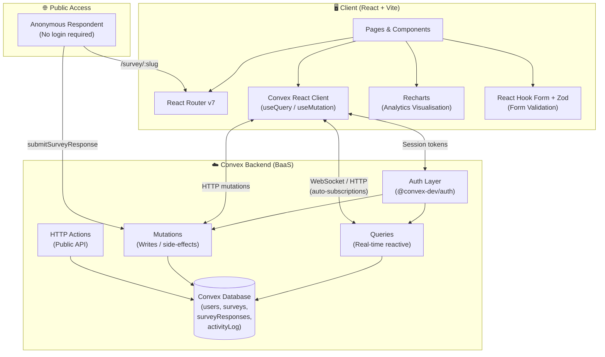
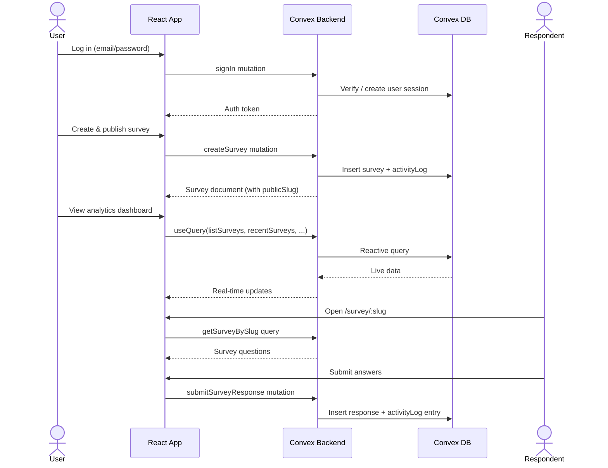

# 📊 InsightEase — AI-Powered Analytic Surveyor

> **"Guided by the Data Sherpa."**
> A full-stack, real-time survey platform with AI-powered analytics, built for students, lecturers, and researchers.

---

## 📋 Table of Contents

- [Overview](#overview)
- [Features](#features)
- [Tech Stack](#tech-stack)
- [System Architecture](#system-architecture)
- [Database Schema](#database-schema)
- [Application Routes](#application-routes)
- [Convex Backend Functions](#convex-backend-functions)
- [Project Structure](#project-structure)
- [Getting Started](#getting-started)
- [Environment Variables](#environment-variables)
- [User Roles](#user-roles)
- [Question Types](#question-types)
- [License](#license)

---

## Overview

**InsightEase** is an AI-powered analytic survey platform designed to make survey creation, distribution, and analysis effortless. It features a real-time backend powered by [Convex](https://convex.dev/), a rich interactive dashboard, AI chatbot assistance, and detailed analytics with chart visualisations.

Key highlights:
- 🔐 Authenticated survey management per user
- 📡 Real-time data sync via Convex reactive queries
- 🤖 AI chatbot for survey data interpretation
- 📈 Rich analytics with Recharts visualisations
- 🌐 Public survey sharing via unique slugs (no login required for respondents)

---

## Features

| Feature | Description |
|---|---|
| **Authentication** | Secure sign-up / log-in via `@convex-dev/auth` |
| **Survey Builder** | Drag-and-drop style editor with 6 question types |
| **AI Chatbot** | Context-aware chatbot for analysing survey results |
| **Analytics Dashboard** | Charts, summary cards, response trends & breakdowns |
| **Survey Management** | Publish, close, reopen, and delete surveys |
| **Public Survey Links** | Shareable slugs — anyone can respond without an account |
| **Activity Log** | Per-user audit trail of all survey events |
| **Download / Export** | Report toolbar with download menu for analytics data |

---

## Tech Stack

### Frontend

| Technology | Version | Purpose |
|---|---|---|
| [React](https://react.dev/) | `^19.2.6` | UI framework |
| [TypeScript](https://www.typescriptlang.org/) | `~6.0.2` | Type safety |
| [Vite](https://vitejs.dev/) | `^8.0.12` | Build tool & dev server |
| [TailwindCSS](https://tailwindcss.com/) | `^4.3.1` | Utility-first styling |
| [React Router](https://reactrouter.com/) | `^7.17.0` | Client-side routing |
| [Recharts](https://recharts.org/) | `^3.10.1` | Data visualisation charts |
| [React Hook Form](https://react-hook-form.com/) | `^7.79.0` | Form state management |
| [Zod](https://zod.dev/) | `^4.4.3` | Schema validation |
| [Lucide React](https://lucide.dev/) | `^1.18.0` | Icon library |
| [clsx](https://github.com/lukeed/clsx) + [tailwind-merge](https://github.com/dcastil/tailwind-merge) | latest | Conditional class utilities |

### Backend

| Technology | Version | Purpose |
|---|---|---|
| [Convex](https://convex.dev/) | `^1.42.0` | Real-time BaaS (DB + serverless functions) |
| [@convex-dev/auth](https://labs.convex.dev/auth) | `^0.0.94` | Authentication layer for Convex |
| [@auth/core](https://authjs.dev/) | `^0.41.1` | OAuth/credentials core adapters |

---

## System Architecture



### Data Flow Diagram



---

## Database Schema

Defined in [`convex/schema.ts`](./convex/schema.ts).

### `users`
| Field | Type | Description |
|---|---|---|
| `email` | `string` | User email (indexed) |
| `role` | `"student" \| "lecturer" \| "researcher" \| "owner"` | User role |
| *(auth fields)* | — | Inherited from `authTables` |

### `surveys`
| Field | Type | Description |
|---|---|---|
| `ownerId` | `Id<"users">` | Owner reference (indexed) |
| `title` | `string` | Survey title |
| `description` | `string` | Survey description |
| `questions` | `Question[]` | Array of question objects |
| `status` | `"draft" \| "published" \| "closed"` | Lifecycle status |
| `publicSlug` | `string?` | URL-safe share slug (indexed) |
| `updatedAt` | `number` | Last modified timestamp |
| `closedAt` | `number?` | Timestamp when closed |

### `surveyResponses`
| Field | Type | Description |
|---|---|---|
| `surveyId` | `Id<"surveys">` | Survey reference (indexed) |
| `answers` | `Record<string, string \| number>` | QuestionId → answer map |

### `activityLog`
| Field | Type | Description |
|---|---|---|
| `userId` | `Id<"users">` | Owner (indexed) |
| `surveyId` | `Id<"surveys">?` | Related survey |
| `type` | `ActivityType` | Event type |
| `surveyTitle` | `string` | Snapshot of title at event time |

**Activity Types:** `survey_edited` · `survey_published` · `survey_closed` · `survey_reopened` · `survey_goal_reached` · `response_received`

---

## Application Routes

| Route | Page | Auth Required |
|---|---|---|
| `/log-in` | Login page | ❌ |
| `/sign-up` | Sign-up page | ❌ |
| `/` | Dashboard | ✅ |
| `/analytics` | Analytics dashboard | ✅ |
| `/survey` | Create / Edit survey | ✅ |
| `/surveys/:id` | Survey management detail | ✅ |
| `/survey/:slug` | **Public** take-survey page | ❌ (anonymous) |
| `/chatbot` | AI chatbot assistant | ✅ |
| `/report` | Reports *(coming soon)* | ✅ |
| `/insights` | Insights *(coming soon)* | ✅ |

---

## Convex Backend Functions

Defined in [`convex/surveys.ts`](./convex/surveys.ts), [`convex/chatbot.ts`](./convex/chatbot.ts), [`convex/users.ts`](./convex/users.ts).

### Queries (Real-time)

| Function | Description |
|---|---|
| `recentSurveys` | Returns the 5 most recently updated surveys for the logged-in user (with response counts) |
| `listSurveys` | Returns all surveys owned by the logged-in user, sorted by last updated |
| `surveyCount` | Returns the total number of surveys for the user |
| `responsesThisMonth` | Returns the total number of responses received this calendar month |
| `avgAnswerRate` | Calculates and returns the average answer completion rate (%) across all surveys |
| `recentActivity` | Returns the 5 most recent activity log entries for the user |
| `getSurveyById` | Fetches a single survey by ID (ownership-checked) |
| `getResponsesForSurvey` | Returns all responses for a given survey (ownership-checked) |
| `getSurveyBySlug` | Fetches a survey by its public slug (unauthenticated — used by respondents) |

### Mutations (Writes)

| Function | Description |
|---|---|
| `createSurvey` | Creates a new survey; auto-generates a `publicSlug` if published |
| `updateSurvey` | Updates an existing survey's content and/or status |
| `closeSurvey` | Closes a survey (stops accepting responses) |
| `reopenSurvey` | Re-publishes a closed survey |
| `deleteSurvey` | Deletes a survey and all its responses (cascading) |
| `submitSurveyResponse` | Records a respondent's answers (no auth required) |

---

## Project Structure

```
ai-powered-analytic-surveyer/
├── convex/                     # Convex backend
│   ├── schema.ts               # Database schema & validators
│   ├── surveys.ts              # Survey queries & mutations
│   ├── chatbot.ts              # AI chatbot actions
│   ├── users.ts                # User queries
│   ├── auth.ts                 # Auth configuration
│   ├── auth.config.ts          # Auth provider config
│   └── http.ts                 # HTTP endpoints
│
├── src/
│   ├── pages/
│   │   ├── dashBoard.tsx       # Main dashboard
│   │   ├── analyticsPage.tsx   # Analytics & charts
│   │   ├── createSurvey.tsx    # Survey builder
│   │   ├── surveyManage.tsx    # Survey detail & management
│   │   ├── publicTakeSurvey.tsx # Public respondent view
│   │   ├── chatbotPage.tsx     # AI chatbot interface
│   │   ├── login.tsx           # Login page
│   │   ├── sign-up.tsx         # Sign-up page
│   │   └── placeholderPage.tsx # Coming-soon placeholder
│   │
│   ├── componet/               # Reusable components
│   │   ├── header.tsx          # App header / nav
│   │   ├── footer.tsx          # App footer
│   │   ├── dashboardLayout.tsx # Shared page layout wrapper
│   │   ├── AnalyticsHeader.tsx # Analytics page header
│   │   ├── AnalyticsSidebar.tsx # Analytics filter sidebar
│   │   ├── ChartCard.tsx       # Recharts card wrapper
│   │   ├── SummaryCards.tsx    # KPI summary cards
│   │   ├── ReportToolbar.tsx   # Analytics toolbar
│   │   ├── DownloadMenu.tsx    # Export / download menu
│   │   ├── InterpretationCard.tsx # AI insight card
│   │   └── publishSuccessModal.tsx # Post-publish modal
│   │
│   ├── lib/                    # Utilities / helpers
│   ├── App.tsx                 # Router setup
│   ├── main.tsx                # App entry point
│   └── index.css               # Global styles
│
├── public/                     # Static assets
├── index.html                  # HTML shell
├── vite.config.ts              # Vite configuration
├── tsconfig.json               # TypeScript config
└── package.json                # Dependencies & scripts
```

---

## Getting Started

### Prerequisites

- **Node.js** v18+
- **npm** v9+
- A [Convex](https://convex.dev/) account (free tier available)

### Installation

```bash
# 1. Clone the repository
git clone <repo-url>
cd ai-powered-analytic-surveyer

# 2. Install dependencies
npm install

# 3. Initialise Convex (first time only)
npx convex dev
```

### Development

Run both the frontend dev server and the Convex backend simultaneously:

**Terminal 1 — Convex backend:**
```bash
npx convex dev
```

**Terminal 2 — Vite frontend:**
```bash
npm run dev
```

The app will be available at `http://localhost:5173`.

### Production Build

```bash
npm run build
```

---

## Environment Variables

Create a `.env.local` file in the project root:

```env
# Convex deployment URL (auto-generated by `npx convex dev`)
VITE_CONVEX_URL=https://<your-deployment>.convex.cloud
```

> **Note:** Additional secrets (e.g. OAuth credentials, AI API keys) are stored as Convex environment variables via the Convex dashboard — not in `.env.local`.

---

## User Roles

| Role | Description |
|---|---|
| `student` | Can create and analyse personal surveys |
| `lecturer` | Can build course/research surveys |
| `researcher` | Full survey and analytics access |
| `owner` | Platform administrator |

---

## Question Types

The survey builder supports the following question types:

| Type | Description |
|---|---|
| `multiple_choice` | Select one option from a list |
| `rating` | Numeric rating scale (configurable max) |
| `long_text` | Open-ended free-text response |
| `dropdown` | Select one option from a dropdown |
| `date` | Date picker input |
| `page_break` | Visual section divider (not a real question) |

---

## License

© 2026 **InsightEase**. All rights reserved. Guided by the Data Sherpa.
